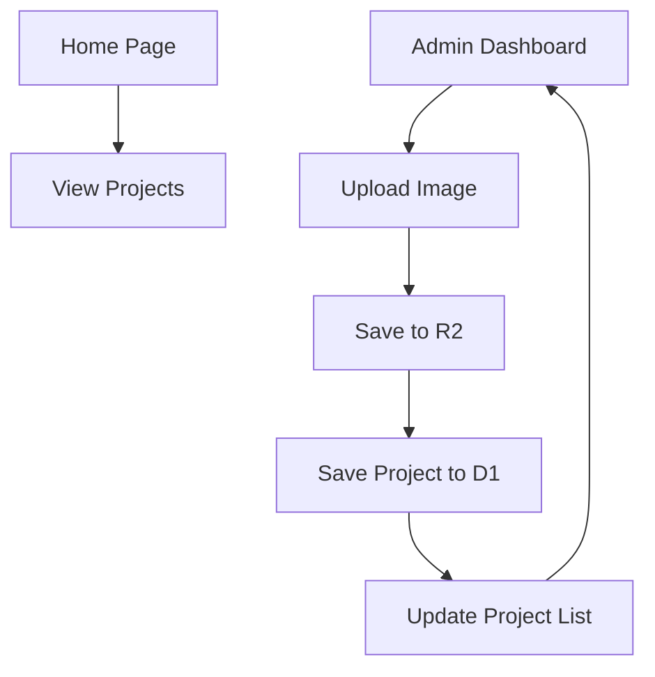

## 1. Product Overview
A high-performance portfolio website built with Astro and Cloudflare ecosystem, featuring a public project showcase and a simple admin panel for content management. This solution enables developers to showcase their work with fast SSR rendering while maintaining an easy-to-use backend for project management.

The product solves the need for a modern, fast-loading portfolio that can be easily updated without complex CMS systems, targeting developers and creative professionals who want full control over their portfolio content.

## 2. Core Features

### 2.1 User Roles
| Role | Registration Method | Core Permissions |
|------|---------------------|------------------|
| Public Visitor | No registration required | View all published projects |
| Admin | Single admin setup via environment variables | Upload images, create/edit/delete projects |

### 2.2 Feature Module
The portfolio website consists of the following main pages:
1. **Home page**: Hero section, project showcase grid with images and descriptions.
2. **Admin dashboard**: Project management form with image upload, title/description fields, and project list.

### 2.3 Page Details
| Page Name | Module Name | Feature description |
|-----------|-------------|---------------------|
| Home page | Hero section | Display welcome message and brief introduction with professional styling |
| Home page | Projects grid | Show all published projects with images, titles, descriptions, and publication dates in responsive grid layout |
| Admin dashboard | Project form | Upload image to Cloudflare R2, input project title and description, save to Astro DB |
| Admin dashboard | Project list | Display existing projects with ability to view, edit, or delete entries |

## 3. Core Process
Admin Flow: Access admin dashboard → Fill project form with title, description, and image → Submit form → Image uploads to R2 → Project details save to D1 → Return to admin dashboard with updated project list.

Public Visitor Flow: Visit homepage → View hero section → Browse projects grid → Click on projects for detailed view (if implemented).

## 4. User Interface Design

### 4.1 Design Style
- **Primary color**: Slate gray (#64748b) for professional appearance
- **Secondary color**: Sky blue (#0ea5e9) for accents and CTAs
- **Button style**: Rounded corners with hover effects, primary buttons use sky blue
- **Font**: System-ui stack for optimal performance, 16px base size
- **Layout style**: Card-based grid layout with generous spacing
- **Icons**: Minimal line icons for UI elements, no emojis for professional tone

### 4.2 Page Design Overview
| Page Name | Module Name | UI Elements |
|-----------|-------------|-------------|
| Home page | Hero section | Full-width dark background with white text, centered headline and subtitle |
| Home page | Projects grid | Responsive 3-column grid on desktop, 1-column on mobile, card shadows on hover |
| Admin dashboard | Project form | Clean white form with labeled inputs, drag-and-drop image upload area, sky blue submit button |
| Admin dashboard | Project list | Table format with project thumbnails, edit/delete icons, pagination if needed |

### 4.3 Responsiveness
Desktop-first design approach with mobile-responsive breakpoints. Touch interaction optimized for mobile devices with appropriately sized tap targets and swipe gestures for image galleries.

### 4.4 Performance Considerations
- Images served from Cloudflare R2 with automatic optimization
- Astro's partial hydration for minimal JavaScript bundle
- SSR for instant initial page loads
- TailwindCSS purged for production builds