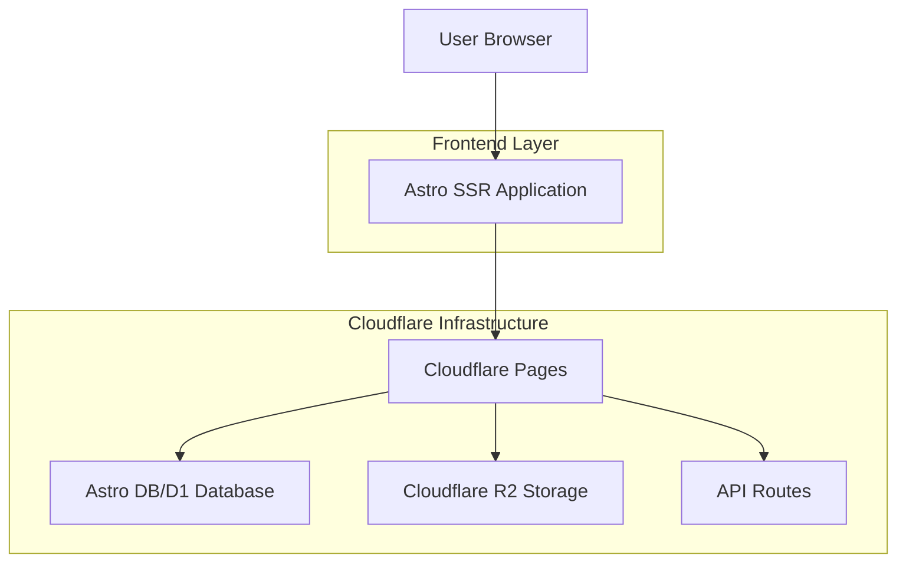
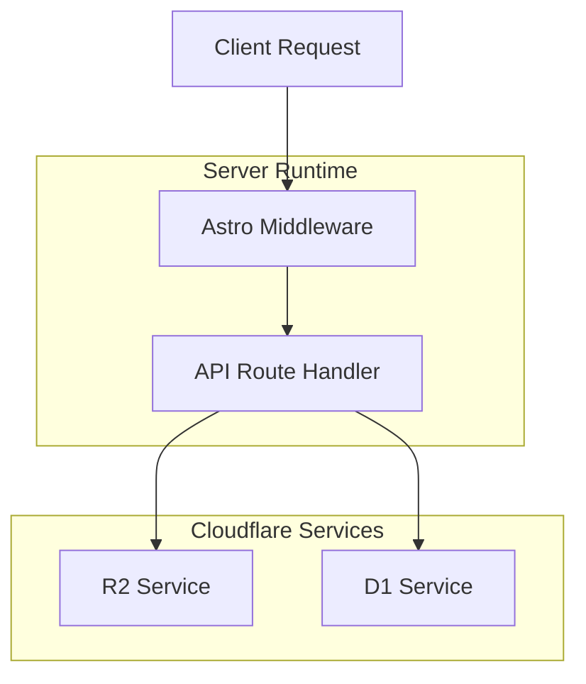
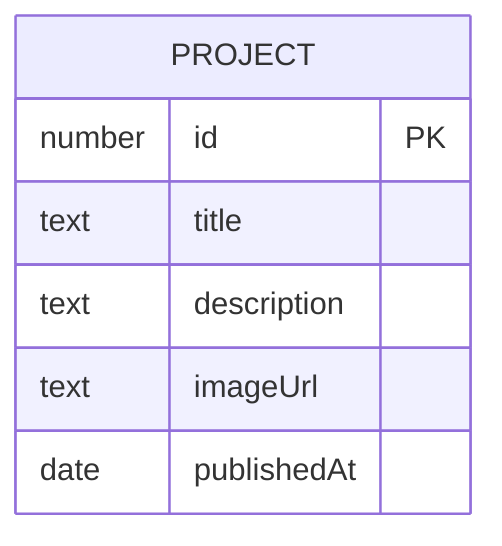

## 1. Architecture Design



## 2. Technology Description
- **Frontend Framework**: Astro@latest with SSR enabled
- **Platform**: Cloudflare Pages with @astrojs/cloudflare adapter
- **Database**: Astro DB utilizing Cloudflare D1 (SQLite)
- **Storage**: Cloudflare R2 for image assets
- **Styling**: TailwindCSS@3
- **Language**: TypeScript throughout
- **Build Tool**: Astro CLI (built-in)

## 3. Route Definitions
| Route | Purpose |
|-------|---------|
| / | Public homepage displaying all projects |
| /admin | Admin dashboard for project management |
| /api/upload | API endpoint for uploading images to R2 |

## 4. API Definitions

### 4.1 Image Upload API
```
POST /api/upload
```

Request:
| Param Name | Param Type | isRequired | Description |
|------------|------------|------------|-------------|
| file | File | true | Image file to upload (max 10MB) |
| filename | string | true | Desired filename for the uploaded image |

Response:
| Param Name | Param Type | Description |
|------------|------------|-------------|
| success | boolean | Upload status |
| url | string | Public URL of uploaded image |
| error | string | Error message if failed |

Example Request (FormData):
```typescript
const formData = new FormData();
formData.append('file', imageFile);
formData.append('filename', 'project-screenshot.jpg');
```

Example Response:
```json
{
  "success": true,
  "url": "https://pub-abc123.r2.dev/project-screenshot.jpg"
}
```

## 5. Server Architecture Diagram



## 6. Data Model

### 6.1 Data Model Definition


### 6.2 Data Definition Language

Projects Table (projects)
```sql
-- Astro DB configuration (db/config.ts)
import { defineDb, defineTable, column } from 'astro:db';

const Projects = defineTable({
  columns: {
    id: column.number({ primaryKey: true }),
    title: column.text(),
    description: column.text(),
    imageUrl: column.text(),
    publishedAt: column.date()
  }
});

export default defineDb({
  tables: { Projects }
});
```

### 6.3 Configuration Files

**astro.config.mjs**:
```javascript
import { defineConfig } from 'astro/config';
import cloudflare from '@astrojs/cloudflare';
import db from '@astrojs/db';

export default defineConfig({
  adapter: cloudflare({
    mode: 'server'
  }),
  integrations: [db()],
  output: 'server'
});
```

**wrangler.toml**:
```toml
name = "portfolio-website"
main = "dist/_worker.js"
compatibility_date = "2024-01-01"

[[d1_databases]]
binding = "DB"
database_name = "portfolio-db"
database_id = "your-d1-database-id"

[[r2_buckets]]
binding = "ASSETS"
bucket_name = "portfolio-assets"
```

### 6.4 Type Definitions

**src/env.d.ts**:
```typescript
/// <reference types="astro/client" />

interface App.Locals {
  runtime: {
    env: {
      DB: D1Database;
      ASSETS: R2Bucket;
    }
  }
}

interface Runtime {
  env: {
    DB: D1Database;
    ASSETS: R2Bucket;
  }
}
```

### 6.5 Deployment Commands

```bash
# Create D1 database
wrangler d1 create portfolio-db

# Create R2 bucket
wrangler r2 bucket create portfolio-assets

# Deploy to Cloudflare Pages
wrangler pages deploy dist/
```